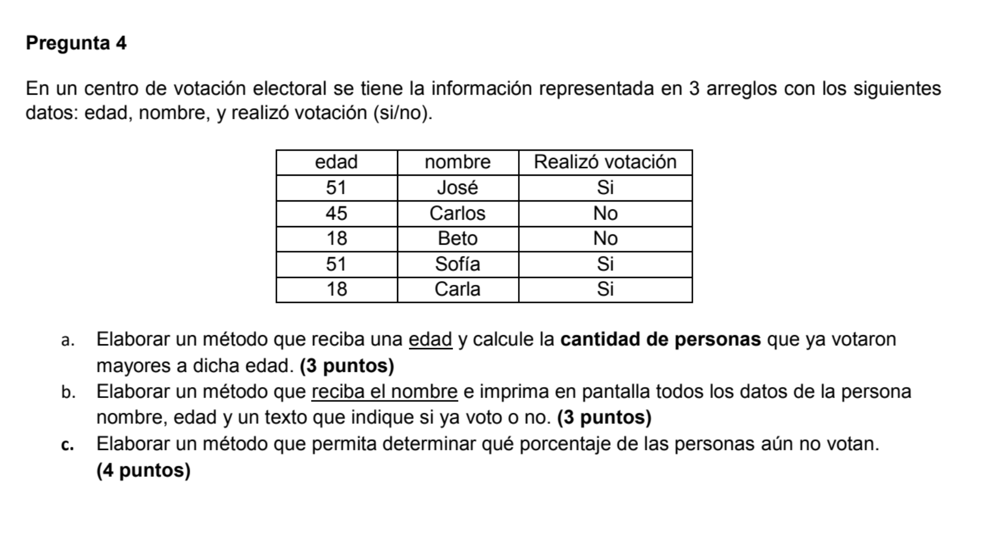

### Repaso Examen Final



Solución:

```java
package com.company;
import java.util.Scanner;

public class Main {

    static int[] edades = { 51, 45, 18, 51, 18 };
    static String[] nombres = { "Jose", "Carlos", "Beto", "Sofia", "Carla" };
    static boolean[] realizoVotacion = { true, false, false, true, true };

    // Calcular cantidad de personas mayores a dicha edad que ya votaron
    public static int obtenerCantidadPersonasQueVotaronMayores(int edad) {
        int contador = 0;
        for (int i=0; i< edades.length; i++) {
            if (edades[i] > edad && realizoVotacion[i] == true) {
                // Es mayor que la edad que nos preguntaron y que realizó votación
                contador++;
            }
        }
        return contador;
    }

    public static String obtenerDatosPersona(String nombre) {
        for (int i=0; i<nombres.length; i++) {
            if (nombres[i].equals(nombre)) {
                return "Nombre de la persona: " + nombres[i] +
                        " \nEdad: " + edades[i] +
                        "\nVoto?: " + ((realizoVotacion[i] == true) ? "Sí" : "No");
            }
        }
        return null;
    }

    public static double obtenerPorcentajePersonasQueNoVotan() {
        int contador = 0;
        for (int i=0; i<realizoVotacion.length; i++) {
            if (realizoVotacion[i] == false) {
                contador++;
            }
        }
        // cantidad de no votantes / cantidad total
        double porcentaje = (double) contador / realizoVotacion.length;
        return porcentaje;
    }

    // D) Obtener un arreglo con edades que no se repitan
    // edades = { 51, 45, 18, 51, 18 };
    // -> Respuesta = { 51, 45, 18 };

    public static int[] obtenerEdadesSinRepetir() {
        int[] resultado = new int[edades.length];
        int pos = 0;

        for (int i=0; i< edades.length; i++) {
            if (!existeElementoEnArreglo(edades[i], resultado)) {
                resultado[pos] = edades[i];
                pos++;
            }
        }

        return resultado;
    }

    public static boolean existeElementoEnArreglo(int elemento, int[] arreglo) {
        for (int i=0; i< arreglo.length; i++) {
            if (arreglo[i] == elemento) {
                return true;
            }
        }
        return false;
    }

    // D.2

    public static int[] obtenerEdadesSinRepetirB() {

        int[] temporales = new int[edades.length];
        int pos = 0;
        int contador = 0;
        for (int i=0; i< edades.length; i++) {
            if (!existeElementoEnArreglo(edades[i], temporales)) {
                temporales[pos] = edades[i];
                pos++;
                contador++;
            }
        }

        int[] resultado = new int[contador];
        for (int i=0; i< contador; i++) {
            resultado[i] = temporales[i];
        }

        return resultado;
    }

    public static void main(String[] args) {

        Scanner input = new Scanner(System.in);

        System.out.println("Ingrese la edad de la persona: ");
        int edad = input.nextInt();
        int resultado = obtenerCantidadPersonasQueVotaronMayores(edad);

        // A
        System.out.println("La cantidad de personas que votaron mayores a " + edad + " años es: " + resultado);

        // B)
        System.out.println("Ingrese el nombre de la persona: ");
        String nombre = input.next();
        String datos = obtenerDatosPersona(nombre);

        System.out.println("Los datos de la persona son: \n" + datos);

        // C)
        double porcentaje = obtenerPorcentajePersonasQueNoVotan();
        System.out.println("El porcentaje de personas que no votan es " + porcentaje * 100 + "%");

        // D)
        System.out.println("Mostrar un arreglo con edades unicas: ");
        int[] edadesUnicas = obtenerEdadesSinRepetir();
        for (int i=0; i< edadesUnicas.length; i++) {
            if (i == 0) { System.out.print(" { "); }
            System.out.print(edadesUnicas[i] + " ");
            if (i == edadesUnicas.length - 1 ) { System.out.print("} "); }
        }

        System.out.println();

        // Forma B
        int[] edadesUnicasB = obtenerEdadesSinRepetirB();
        for (int i=0; i< edadesUnicasB.length; i++) {
            if (i == 0) { System.out.print(" { "); }
            System.out.print(edadesUnicasB[i] + " ");
            if (i == edadesUnicasB.length - 1 ) { System.out.print("} "); }
        }
    }
}	
```

