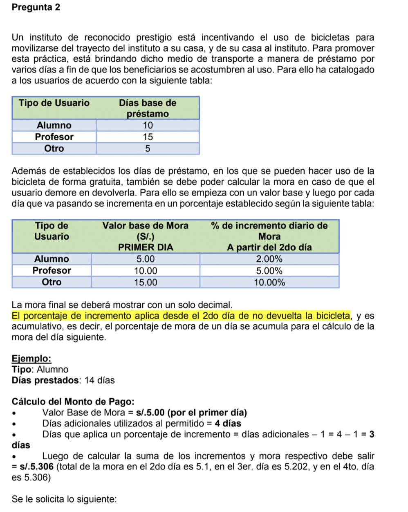
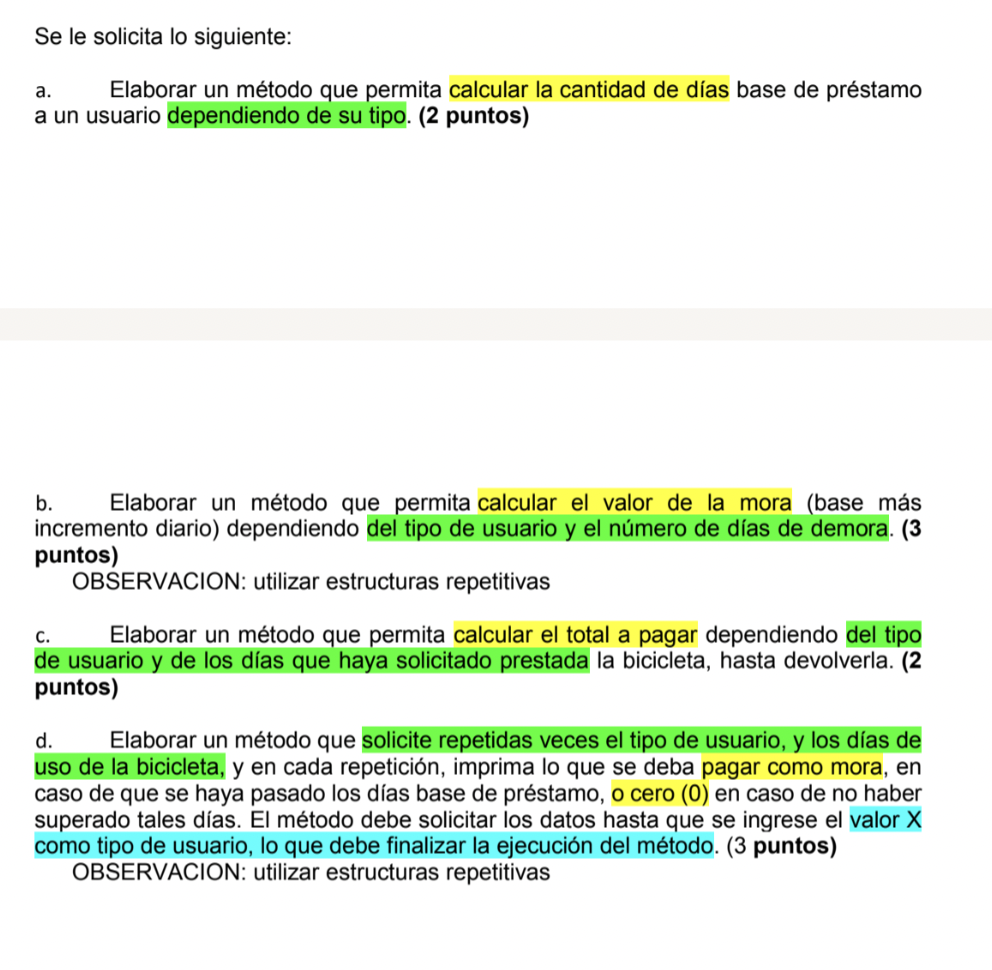

## Repaso Repetitivas






````java
import java.util.Scanner;

public class Main {

    // A)
    public static int calcularDiasBasePrestamo(String tipoUsuario) {
        int diasPrestamo = 0;
        if (tipoUsuario.equals("Alumno")) {
            diasPrestamo = 10;
        } else if (tipoUsuario.equals("Profesor")) {
            diasPrestamo = 15;
        } else if (tipoUsuario.equals("Otro")) {
            diasPrestamo = 5;
        }
        return diasPrestamo;
    }

    // B)
    public static double calcularValorBaseMora(String tipoUsuario) {
        double valorBaseMora = 0;
        if (tipoUsuario.equals("Alumno")) {
            valorBaseMora = 5;
        } else if (tipoUsuario.equals("Profesor")) {
            valorBaseMora = 10;
        } else if (tipoUsuario.equals("Otro")) {
            valorBaseMora = 15;
        }
        return valorBaseMora;
    }

    public static double calcularPorcentajeMora(String tipoUsuario) {
        double porcentajeIncrementoMora = 0;
        if (tipoUsuario.equals("Alumno")) {
            porcentajeIncrementoMora = 2.0/100.0;
        } else if (tipoUsuario.equals("Profesor")) {
            porcentajeIncrementoMora = 5.0/100.0;
        } else if (tipoUsuario.equals("Otro")) {
            porcentajeIncrementoMora = 10.0/100.0;
        }
        return porcentajeIncrementoMora;
    }

    public static double calcularValorMora(String tipoUsuario, int diasMora) {
        // Determinar el % de incremento de mora
        double porcentajeIncrementoMora = calcularPorcentajeMora(tipoUsuario);
        double totalValorMora = 0;
        for (int i=1; i<=diasMora; i++) {
            if (i == 1) {
                // Aplicar la base de mora para el primer dia
                totalValorMora = calcularValorBaseMora(tipoUsuario);
            } else {
                // Aplicar el incremento de mora desde el segundo dia
                totalValorMora = totalValorMora * (1 + porcentajeIncrementoMora);
            }
        }
        return totalValorMora;
    }

    // C)
    public static double calcularTotalValorMora(String tipoUsuario, int diasPrestado) {
        int diasBasePrestamo = calcularDiasBasePrestamo(tipoUsuario);
        double valorTotalMora = 0;
        if (diasPrestado <= diasBasePrestamo) {
            return valorTotalMora;
        }

        int diasMora = diasPrestado - diasBasePrestamo;
        valorTotalMora = calcularValorMora(tipoUsuario, diasMora);
        return valorTotalMora;
    }

    public static void main(String[] args) {

        System.out.println("A)");
        String tipoUsuario = "Alumno";
        int diasBase = calcularDiasBasePrestamo(tipoUsuario);
        System.out.println("La cantidad de días base de préstamo para un " + tipoUsuario + " es " + diasBase);

        System.out.println("B)");
        int diasMora = 4;
        double totalMora = calcularValorMora(tipoUsuario, diasMora);
        System.out.printf("El valor de la mora total de %d días de mora para un usuario %s, es S/%.1f \n", diasMora, tipoUsuario, totalMora);

        System.out.println("C)");
        int diasTotalPrestado = 14;
        double totalValorMora = calcularTotalValorMora(tipoUsuario, diasTotalPrestado);
        System.out.printf("El valor de la mora total para %d días de préstamo para un usuario %s, es S/%.1f \n", diasTotalPrestado, tipoUsuario, totalValorMora);

        Scanner input = new Scanner(System.in);
        System.out.println("D)");
        System.out.println("==========================");
        String tipoUsuarioIngresado;
        do {
            System.out.println("Ingrese el tipo de Usuario:");
            tipoUsuarioIngresado = input.next();

            if (!tipoUsuarioIngresado.equals("x")) {

                System.out.println("Ingrese la cantidad de dias prestado: ");
                int cantidadDiasPrestadoIngresado = input.nextInt();

                double totalValorMoraCalculado = calcularTotalValorMora(tipoUsuarioIngresado, cantidadDiasPrestadoIngresado);
                System.out.printf("El valor de la mora total para %d días de préstamo para un usuario %s, es S/%.1f \n", cantidadDiasPrestadoIngresado, tipoUsuarioIngresado, totalValorMoraCalculado);
            }
        } while (!tipoUsuarioIngresado.equals("x"));
    }
}
````


## Introducción Arreglos

#### Introducción

```java
public class Main {

    public static void main(String[] args) {

        // Declarando multiples variables para manejar las notas de un salón
        double notaPC1Jose = 13;
        double notaPC1Carlos = 15;
        double notaPC1Karla = 12;
        double notaPC1Javier = 15.4;

        // Lectura
        System.out.println(notaPC1Jose);
        // Asignación
        notaPC1Jose = 6;

        System.out.println("Arreglos");

        // Declaración
        double notaPC1Alumnos[];
        // Inicialización
        notaPC1Alumnos = new double[4];

        // Declaración + Inicialización en una sola linea
        double[] notasFinalesAlumnos = new double[4];

        // Declaración + Inicialización + Asignación en una sola linea
        String[] nombresAlumnos = { "Jose", "Ricardo", "Carlos", "Karla", "Felipe" };

        // Asignación
        notaPC1Alumnos[0] = 8;
        notaPC1Alumnos[3] = 15.4;
        // Lectura
        System.out.println(notaPC1Alumnos[3]);
        System.out.println("El tamaño del arreglo notaPC1Alumnos es " + notaPC1Alumnos.length);

        System.out.println("La cantidad de elementos en el arreglo de nombres es " + nombresAlumnos.length);

        System.out.println("Lista de alumnos:");
        for (int i=0; i< nombresAlumnos.length; i++) {
            System.out.println(nombresAlumnos[i]);
        }
    }
}
```


#### Ejercicio

Una empresa vendedora de fotocopiadoras necesita calcular cual ha sido el volumen de ventas de cada uno de sus agentes comerciales durante el presente mes y en base a eso determinar distintos indicadores así como montos a pagar en comisión de ventas. Se le solicita:

1. Obtener el total de unidades vendidas durante el presente mes. Para eso se tiene comodato de entrada un arreglo con la cantidad de unidades vendidas por cada agentecomercial.
2. Si se sabe que la cuota de venta de cada vendedor es 5 unidades, determinar cuál es el porcentaje de vendedores que superaron la cuota de venta. Para eso se tiene como datode entrada un arreglo con la cantidad de unidades vendidas por cada agente comercial.
3. Se desea saber quién(es) fueron los agentes de ventas que superaron la cuota de venta.
4. Si se sabe que por cada unidad vendida se tiene que pagar una comisión de ventas de300 soles, determinar cuánto es lo que se tiene que pagar como comisión este mes.


```java
public class Main {

    // 1)
    public static int calcularTotalUnidadesVendidas(int[] cantidadesVendidas) {
        int sumaTotal = 0;
        for (int i=0; i< cantidadesVendidas.length; i++) {
            sumaTotal = sumaTotal + cantidadesVendidas[i];
        }
        return sumaTotal;
    }

    // 2)
    public static double calcularPorcentajeVendedoresSuperaronCuotaVenta(int[] cantidadesVendidas) {
        int cantidadSuperaronCuota = 0;
        for (int i=0; i< cantidadesVendidas.length; i++) {
            if (cantidadesVendidas[i] > 5) {
                cantidadSuperaronCuota++;
            }
        }
        double porcentajeSuperaronCuota = (double) cantidadSuperaronCuota / cantidadesVendidas.length;
        return porcentajeSuperaronCuota;
    }

    // 3)
    public static void encontrarVendedoresSuperaronCuotaVenta(int[] cantidadesVendidas, String[] nombresAgentes) {
        for (int i=0; i< cantidadesVendidas.length; i++) {
            if (cantidadesVendidas[i] > 5) {
                String nombreAgente = nombresAgentes[i];
//                System.out.println("El agente " + nombreAgente + " en posicion " + i + " superó la cuota");
                System.out.print(nombreAgente);
                if (i == cantidadesVendidas.length - 1) {
                    System.out.print("\n");
                } else {
                    System.out.print(", ");
                }
            }
        }
    }

    public static void main(String[] args) {

        int[] arregloUnidadesVendidas = { 4, 3, 8, 12, 1, 0, 17, 1 };
        String[] arregloNombreAgentes = { "Jose", "Carlos", "Carolina", "Piero", "Jorge", "Sofia", "Karla", "Melisa" };
        int sumaTotal = calcularTotalUnidadesVendidas(arregloUnidadesVendidas);
        System.out.println("La suma total de unidades vendidas es " + sumaTotal);

        double porcentajeSuperaronCuota = calcularPorcentajeVendedoresSuperaronCuotaVenta(arregloUnidadesVendidas);
        System.out.printf("El porcentaje de vendedores que superaron la cuota mínima es de %.0f%% \n", (porcentajeSuperaronCuota * 100));

        encontrarVendedoresSuperaronCuotaVenta(arregloUnidadesVendidas, arregloNombreAgentes);
    }
}
```

